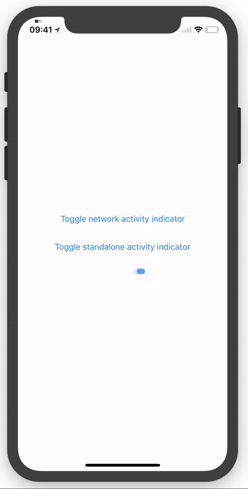

# FTLinearActivityIndicator

[](https://travis-ci.org/futuretap/FTLinearActivityIndicator)
[](http://cocoapods.org/pods/FTLinearActivityIndicator)
[](http://cocoapods.org/pods/FTLinearActivityIndicator)
[](http://cocoapods.org/pods/FTLinearActivityIndicator)

iPhone X does not display the network activity indicator anymore. This framework brings it
back by placing an activity indicator in the upper left of the screen on top of the
regular status bar items.

Since a circular indicator wouldn't fit, a rectangular 
[KITT scanner](https://giphy.com/gifs/scanner-vD9c1fVxaYZnq)-like indicator with a gradient is shown. The indicator UI can be used standalone or as a "fix" for the iOS network activity indicator (using the
existing API).



## Integration
### Use as a fix for the system network activity indicator

In your app delegate's didFinishLaunching method, just call

    UIApplication.configureLinearNetworkActivityIndicatorIfNeeded()

Then, use the standard network activity indicator just as you're used to.

### Use as a standalone view

Include a `FTLinearActivityIndicator` view in your storyboard or instantiate it from code. The class supports the following methods and properties, using a similar API as the iOS `UIActivityIndicatorView`:

- `startAnimating()`
- `stopAnimating()`
- `isAnimating: Bool`
- `hidesWhenStopped: Bool`

`tintColor` is supported to colorize the indicator gradient.

## Example

To run the example project, clone the repo, and run `pod install` from the Example directory first.

## Requirements
Written in Swift 4.0. Should run under any iOS (obviously, the iPhone X requires iOS 11 or higher).

## Installation

FTLinearActivityIndicator is available through [CocoaPods](http://cocoapods.org). To install
it, simply add the following line to your Podfile:

```ruby
pod 'FTLinearActivityIndicator'
```

## Author

Ortwin Gentz, [FutureTap GmbH](https://www.futuretap.com)

Twitter: [@ortwingentz](https://twitter.com/ortwingentz)

## License

FTLinearActivityIndicator is available under the CC-BY-SA 4.0 license. You may copy and redistribute, adapt and build upon the framework for any purpose, even commercially, as long as you give credit to me in the About menu or a similar place in the app.

See the LICENSE file for more info.
